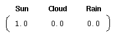

## 生成模式

1. **确定性模式（Deterministic Patterns）**：

    比如红绿灯，如果现在是红灯那么下一个一定是绿灯，如果现在是绿灯那么下一个一定是黄灯，而如果现在是黄灯那么下一个一定是红灯。

    不难发现这里每一个状态都只依赖前一个状态，那么该系统是确定性的。确定性系统相对比较容易理解和分析，因为状态间的转移是完全已知的。

2. **非确定性模式（Non-deterministic patterns）**：

    以天气为例，我们很难像上文确定性模型一样仅根据今天的天气来准确推测明天的天气，而马尔科夫假设则是假定今天的天气只能通过过去几天已知的天气情况有关，这个预测过程被称之为$n$阶马尔科夫模型，其中$n$是影响下一个状态选择的（前）$n$个状态。

    当然我们发现这个假设是不切实际的，因为其没有考虑到很多隐藏的重要信息，比如风力风向气压等等。

    对于有$M$个状态的一阶马尔科夫模型，共有$M^2$个状态转移，因为任何一个状态都有可能是所有状态的下一个转移状态。每一个状态转移都有一个概率值，称为状态转移概率——这是从一个状态转移到另一个状态的概率。所有的$M^2$个概率可以用一个状态转移矩阵表示。注意这些概率并不随时间变化而不同——这是一个非常重要（但常常不符合实际）的假设。

    下面的状态转移矩阵显示的是天气例子中可能的状态转移概率：

    
    
    这个转移矩阵的意思是如果昨天是晴天，那么今天是晴天的概率为$0.5$，多云的概率为$0.375$，下雨的概率为$0.125$。
    
    这个模型在初始化的时候我们需要定义一个初始的概率向量$p_i$比如：
    
    
    
    现在我们便可以定义一个一阶的马尔可夫过程如下：
    
    1. 状态：三种天气
    2. $p_i$向量：表示初始状态
    3. 状态转移矩阵
    
    任何一个可以用这种方式描述的系统都是一个马尔科夫过程。
