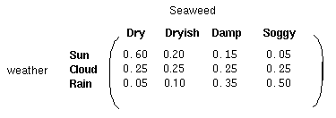

## 隐藏模式

1. **马尔可夫模型的局限性：**

    我们发现，马尔可夫模型仅仅依靠以前的状态进行预测，却忽视了许多关键的隐藏信息，很多时候观测到的状态序列与隐藏过程有一定的概率关系。

    接下来我们使用隐马尔科夫模型对这样的过程建模，这个模型包含了一个底层隐藏的随时间改变的马尔科夫过程，以及一个与隐藏状态某种程度相关的可观察到的状态集合。

2. **隐马尔科夫模型（Hidden Markov Models）：**

    下图显示的是天气例子中的隐藏状态和观察状态。假设隐藏状态（实际的天气）由一个简单的一阶马尔科夫过程描述，那么它们之间都相互连接。

    

    这里不难发现某个观察状态指向的的所有隐藏状态的概率之和为$1$，即$P(Obs|Sum)+P(Obs|Cloud)+P(Obs|Rain)=1$。

    除了定义了马尔科夫过程的概率关系，我们还有另一个矩阵，定义为混淆矩阵（confusion matrix），它包含了给定一个隐藏状态后得到的观察状态的概率。对于天气例子，混淆矩阵是：

    

    注意这里每一行之和也是$1$。

## 总结

我们使用一个隐马尔科夫模型（HMM）对上文类似的例子建模。这个模型包含两组状态集合和三组概率集合：

1. 隐藏状态：一个系统的（真实）状态，可以由一个马尔科夫过程进行描述（例如，天气）。
2. 观察状态：在这个过程中‘可视’的状态（例如，海藻的湿度）。
3. $p_i$向量：包含了（隐）模型在时间$t=1$时一个特殊的隐藏状态的概率（初始概率）。
4. 状态转移矩阵：包含了一个隐藏状态到另一个隐藏状态的概率
5. 混淆矩阵：包含了给定隐马尔科夫模型的某一个特殊的隐藏状态，观察到的某个观察状态的概率。

因此一个隐马尔科夫模型是在一个标准的马尔科夫过程中引入一组观察状态，以及其与隐藏状态间的一些概率关系。
